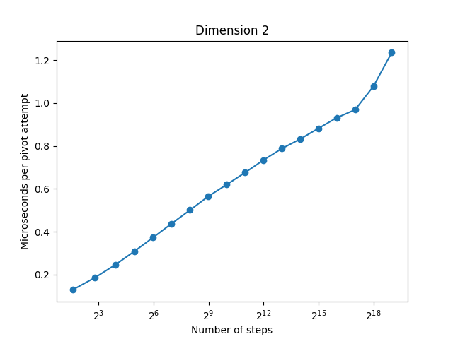

> [!NOTE]
> For an even more optimized implementation of the pivot algorithm in 2D, see [pivot-simd](https://github.com/bencwallace/pivot-simd).

# pivot

A fast implementation of the pivot algorithm for sampling the
[self-avoiding walk](https://en.wikipedia.org/wiki/Self-avoiding_walk).

1. [Description](#description)
2. [Download](#download)
3. [Build](#build)
4. [Usage](#usage)
5. [Benchmarks](#benchmarks)
6. [Examples](#examples)
7. [Limitations and future work](#limitations-and-future-work)
8. [References](#references)

## Description

The self-avoiding walk (SAW) is a model of linear polymers given by uniformly sampling
from the set of all possible paths on a lattice that do not intersect themselves.
In statistical physics, the main questions about this model revolve around its asymptotic
statistical properties as the number of steps in the path increases. These problems have
been studied using techniques from theoretical physics and rigorous mathematics as well
as computational methods, which are the focus of this project.

The *pivot algorithm* is a [Markov chain Monte Carlo](https://en.wikipedia.org/wiki/Markov_chain_Monte_Carlo)
approach to simulating the SAW. The algorithm consists of a sequence of "pivot moves": random
rigid transformations applied at random points of a walk, thereby pivoting one end about the other.
In a [2010 paper](#1), [Nathan Clisby](https://clisby.net) introduced the
*saw-tree* data structure, enabling a massive performance improvement to this algorithm.

This repository provides an implementation of the saw-tree pivot algorithm.

## Download

[Releases](https://github.com/bencwallace/pivot/releases) are available for Linux (x64) and macOS (arm64).

## Build

CMake and a suitable C/C++ compiler toolchain are required.

**Requirements**

Aside from CMake and a suitable C/C++ compiler toolchain (gcc, clang), the following are required:

* [libgraphviz](https://gitlab.com/graphviz/graphviz)
  * Only needed at build time (optional at runtime)
* [boost 1.81+](https://www.boost.org/doc/libs/1_81_0/more/getting_started/index.html) (headers only)

For instance, these can be installed as follows on Ubuntu 22.04+ as follows:

```bash
sudo apt update && sudo apt install libboost-dev libgraphviz-dev
```

**Build**

Some recommended [CMake presets](CMakePresets.json) are included. For instance, a release build proceeds as follows:

```
cmake --preset release
cmake --build --preset release -j
```

**Maximum number of dimensions**

The maximum number of dimensions supported is a compile-time constant. It can be set by providing the `DIMS_UB` option to CMake,
which sets the exclusive upper bound on the dimensions supported. For instance, to support all dimensions up to and including 10,
one would set `DIMS_UB` to 11 as follows:

```
cmake --preset release -DDIMS_UB=11
cmake --build build --preset release -j
```

At the time of writing, the default value of `DIMS_UB` is 6. The most up-to-date default can be found by looking at
[CMakeLists.txt](CMakeLists.txt).

**Documentation**

To build documentation with Doxygen, simply run

```
doxygen Doxyfile
```

## Usage

For usage instructions, run the following command (assuming the `pivot` executable is in the `build` directory):

```
./build/pivot --help
```

## Benchmarks

A simple [benchmark script](./scripts/benchmark.py) in Python (requires matplotlib) is included.
Semi-log plots of running times per pivot attempt (after a warm up period) in dimensions 2 and 3 are provided below
for both fast and slow versions of the (tree-based) algorithm.
Both plots reflect the results of benchmarking on an Apple Silicon M1 Pro CPU. Random seed 42 was used.

| | |
|-|-|
|||

The raw data for these plots can be found in the `bench/` directory (file names `times_{2,3}_{fast,slow}.json`).

## Examples

**Plotting a walk**

Attempt $10^6$ pivots on a $10^6$ step walk in $2$ dimensions:

```
mkdir out
./build/pivot -d 2 --steps 1000000 --iters 1000000 --out out
```

Plot the output (requires [matplotlib](https://matplotlib.org/)):

```
python scripts/plot.py out/walk.csv
```

An interactive plot can also be made with [Plotly](https://plotly.com/) if you have it available by
adding a second, truthy argument (e.g. `python plot.py out/walk.csv 1`).
For instance, the plot below was generated as above (with `--seed 42`):

[](https://bcwallace.com/pivot2d_1e6_1e6_42.html)

The interactive version of this plot is available by clicking on the image above.

**Estimating critical exponents**

The expected squared end-to-end distance $\langle |X(N)|^2 \rangle$ of an $N$-step self-avoiding walk
is believed to obey a power law of the form $C N^{2\nu}$. The exponent $\nu$ is an
example of a [critical exponent](https://en.wikipedia.org/wiki/Critical_exponent) and can be estimated
from samples gathered by running the pivot
algorithm over varying values of $N$.

In the example below, we increase the number of samples with the walk length as the pivot algorithm
needs a longer warm-up period to attain the equilibrium distribution for longer walks.

```bash
mkdir data
for i in $(seq 0 10)
do
  steps=$((1000 * 2 ** i))
  ./build/pivot --success -d 2 -s ${steps} -i $((2 * steps)) --out data
  mv data/endpoints.csv data/${steps}.csv
done
```

The resulting data can be analyzed using the tools of your choice. An [example script](./scripts/estimate_nu.py)
using Python is provided (requires NumPy, SciPy, and matplotlib) and can be run on the output produced above as follows:

```bash
python scripts/estimate_nu.py data
```

The output should be close to 3/4, the predicted value for $\nu$ in 2 dimensions.
An example log-log plot as generated above is shown below.


**Print the saw-tree data structure**

The following example requires the [GraphViz runtime](https://graphviz.org/download/). On Ubuntu, for instance,
this can be installed as follows:

```bash
sudo apt-get update && sudo apt-get install graphviz
```

`pivot`'s C++ API allows the internal saw-tree data structures used by Clisby's pivot algorithm to be
exported to GraphViz format (i.e. dot format). For instance, the following generates the walk-tree
depicted in [[1, Figure 23]](https://arxiv.org/pdf/1005.1444#page=33):

```cpp
#include <vector>

#include "walk_tree.h"

int main() {
  auto steps = std::vector{pivot::point<2>({1, 0}), pivot::point<2>({1, 1}), pivot::point<2>({2, 1}),
                           pivot::point<2>({3, 1}), pivot::point<2>({3, 0})};
  auto walk = pivot::walk_tree<2>(steps);
  walk.todot("walk.dot");

  return 0;
}
```

The resulting dot file can be found under [assets/walk.dot](assets/walk.dot). The image below can
be generated from this file by running GraphViz as follows:

```
dot -Tpng walk.dot -o walk.png
```


## Limitations and future work

I hope to make the following changes in the future:

* Support multithreaded pivot proposals (cf. [[3]](#3))
* Improve initialization methods (e.g. Clisby's `pseudo_dimerize` method)

The following are some other potentially interesting directions to explore:

* Allow soft-core interactions (Domb-Joyce model) [[2]](#2)
* Allow attractive interactions
* Allow long-range step distributions
* Support non-cubic lattices

## References

<a id="1">[1]</a>
<a href="https://doi.org/10.1007/s10955-010-9994-8">
N. Clisby.
Efficient implementation of the pivot algorithm for self-avoidoing walks.
Journal of Statistical Physics., 140:349-392, (2010).
</a>

<a id="2">[2]</a>
<a href="https://dx.doi.org/10.1088/1742-6596/921/1/012012">
N. Clisby.
High resolution Monte Carlo study of the Domb-Joyce model.
Journal of Physics: Conference Series., 921:012012, (2017).
</a>

<a id="3">[3]</a>
<a href="https://iopscience.iop.org/article/10.1088/1742-6596/2122/1/012008">
N.Clisby and D. Ho.
Off-lattice and parallel implementations of the pivot algorithm.
Journal of Physics: Conference Series., 2122:012008, (2021).
</a>
